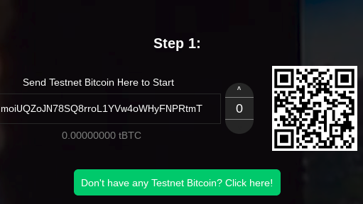
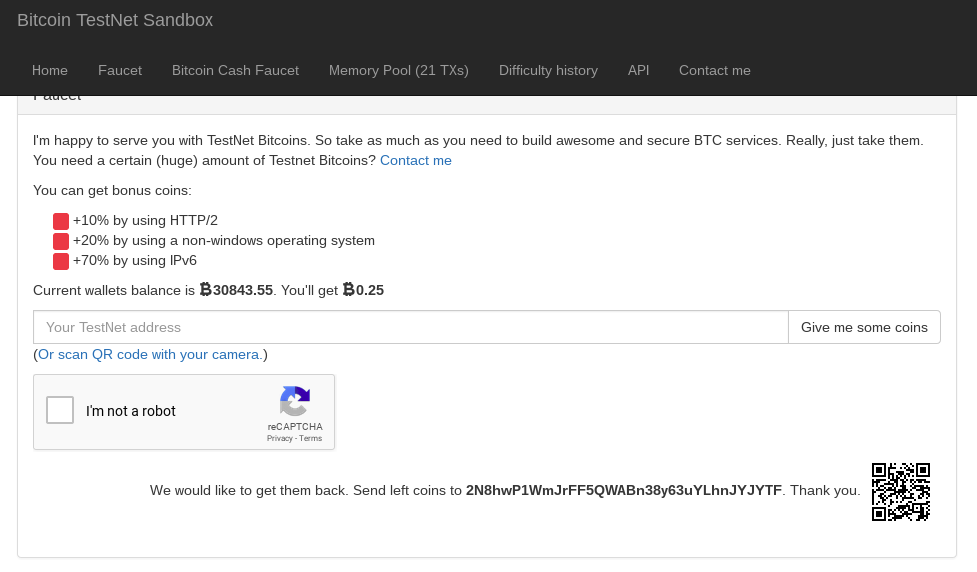
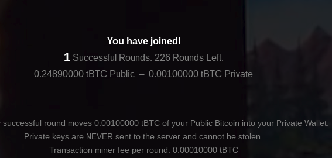
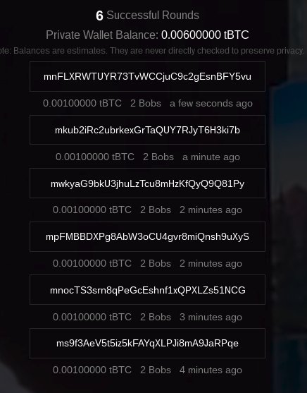
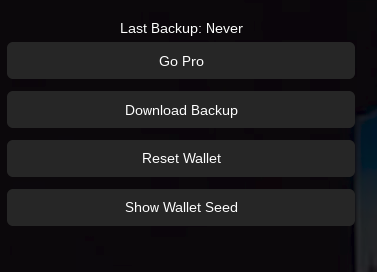
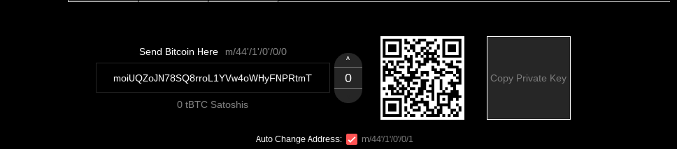
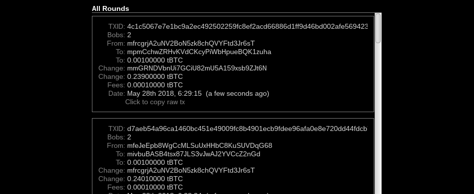

# SecuBit Wallet User Guide

**Documentation Version 1.1**  
**SecuBit Wallet Version 0.1.0**  

Note: The version of SecuBit Wallet that this guide is written for only runs on the bitcoin testnet.

## (Optional) Step 1. Download and install the Tor Browser

_If you already have Tor Browser installed, or you want to use another browser, you can skip to Step 2._

Tor Browser is used to anonymize the connection between SecuBit Wallet and the mixing server. You can download Tor Browser [here](https://www.torproject.org/download/download-easy.html).

## Step 2. Start your browser and open SecuBit Wallet

You can open SecuBit Wallet by [downloading SecuBit Wallet](https://github.com/acashmkj/SecuBit/archive/master.zip), unzip the SecuBit zip folder, and open (drag and drop) `secubitwallet.html` from the unzipped folder into your browser.

## Step 3. Create a new SecuBit Wallet

**Easy**
Click the `Start` button to create a new SecuBit Wallet. Save the backup file somewhere on your computer so you can pick up where you leave off if you need to close SecuBit Wallet. Since this is only a testnet wallet, you don't have to be as careful about how this backup file is stored as you would be if it were storing real value on the bitcoin mainnet.

**Advanced**
Click `Advanced` to manually enter your seed phrases. Fill out each field by hand with a valid seed phrase or click the `Generate` buttons to have SecuBit Wallet generate your seed phrases for you.

Click `Next` then `Download Backup` to proceed to the next screen. Save the backup file somewhere on your computer so you can pick up where you leave off if you need to close SecuBit Wallet. Since this is only a testnet wallet, you don't have to be as careful about how this backup file is stored as you would be if it were storing real value on the bitcoin mainnet.

_The wallet seeds shown in the image below are only examples and should not be reused in your own wallet._

## Step 4. Deposit testnet bitcoin into your Public Wallet

The Public Wallet is where you will deposit the coins that you would like to mix. The Private Wallet is where the coins will end up after they have been mixed.

Click the address shown on the Public Wallet tab of your SecuBit Wallet to copy the address to your clipboard. Visit [this testnet bitcoin faucet](https://testnet.manu.backend.hamburg/faucet), paste your address, then click `Give me some coins` to have testnet coins sent to your address. You may need to complete a CAPTCHA before the website will let you click the button to receive testnet bitcoins.

## Step 5. Mix your coins

Once the testnet deposit is confirmed, SecuBit Wallet will automatically enter you into CoinJoin rounds with other SecuBit Wallet users. Successful rounds will move coins from your Public Wallet to your Private Wallet. SecuBit Wallet will automatically add you into subsequent rounds until all of your Public Bitcoin is moved to your Private Wallet.

SecuBit Wallet must be kept open for the mixing process to happen. If you disconnect during the Join stage you will be removed from the round. If you disconnect mid-round then you will be blamed for stopping the round and a new round will start without you. Right now it is less important if a round is stopped since punishments haven't yet been added and rounds are quick.

## Optional: Change SecuBit Wallet Settings

There is a Settings tab where you can change SecuBit Wallet settings, download a backup file, reset and start with a new wallet, and show your wallet seeds. If you try to reset the wallet, SecuBit Wallet will automatically show a pop up to download a wallet backup file in case you don't have a backup saved yet.

In the Settings tab you can change the denomination shown in your SecuBit Wallet from bitcoin to satoshis.

You can also enable Pro mode to see what is going on behind the scenes in SecuBit Wallet and change advanced settings.

